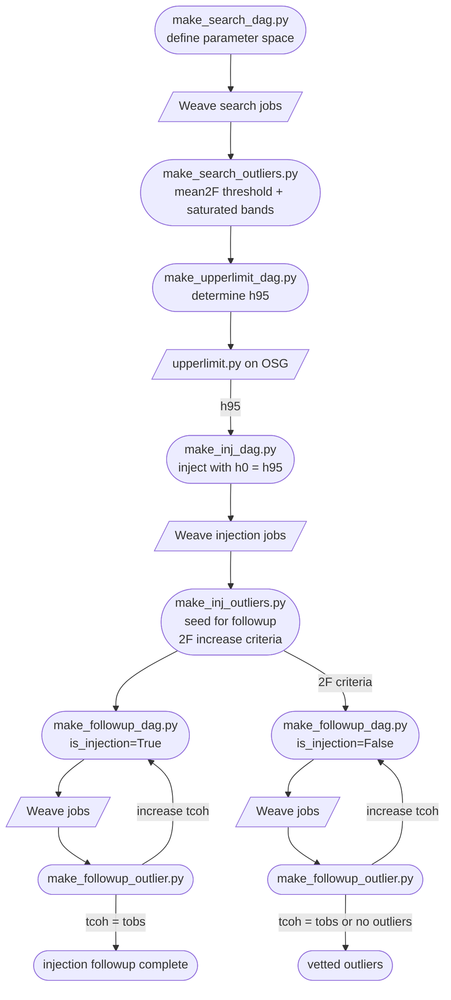

# PAWS Example Scripts

## Pipeline Flowchart

```mermaid
flowchart TD
    A([make_search_dag.py\ndefine parameter space]) --> B[/Weave search jobs/]
    B --> C([make_search_outliers.py\nmean2F threshold + saturated bands])

    C --> D([make_upperlimit_dag.py\ndetermine h95])
    D --> E[/upperlimit.py on OSG/]

    E -->|h95| F([make_inj_dag.py\ninject with h0 = h95])
    F --> G[/Weave injection jobs/]
    G --> H([make_inj_outliers.py\nseed for followup\n2F increase criteria])

    H --> I([make_followup_dag.py\nis_injection=True])
    I --> J[/Weave jobs/]
    J --> K([make_followup_outlier.py])
    K -->|increase tcoh| I
    K -->|tcoh = tobs| INJ_DONE([injection followup complete])

    H -->|2F criteria| M([make_followup_dag.py\nis_injection=False])
    M --> N[/Weave jobs/]
    N --> O([make_followup_outlier.py])
    O -->|increase tcoh| M
    O -->|tcoh = tobs or no outliers| P([vetted outliers])
```
